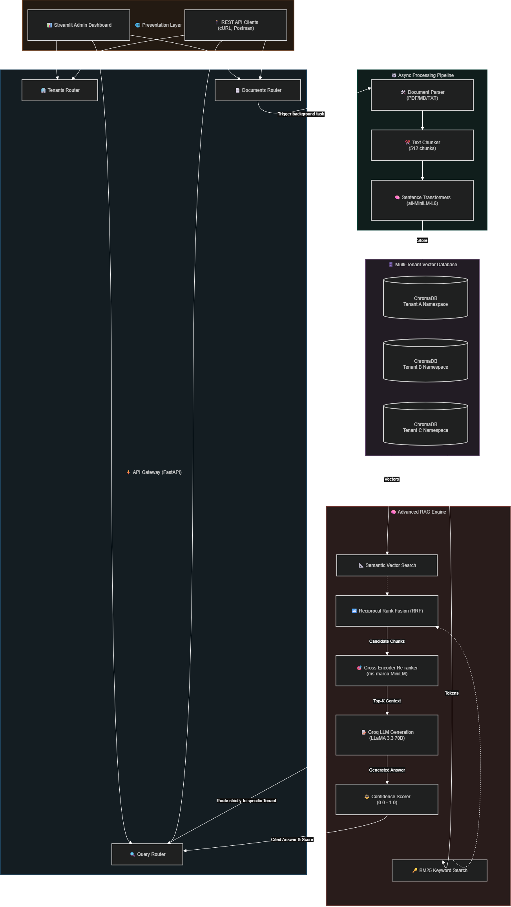

# 🏢 Enterprise Document Intelligence Platform — Project 3-P-A

A production-grade, multi-tenant document intelligence API built with FastAPI. Users upload documents that are automatically processed and indexed. The query endpoint returns AI-generated answers with confidence scores, source chunks, and page numbers — all powered by advanced RAG with hybrid search and cross-encoder re-ranking.

## 🏗️ Architecture

```
┌───────────────────────────────────────────────────────────────────────────┐
│                 ENTERPRISE DOCUMENT INTELLIGENCE PLATFORM                  │
│                                                                            │
│  ┌─────────────┐     ┌──────────────────────────────────────────────────┐ │
│  │   FastAPI    │     │              INGESTION PIPELINE                  │ │
│  │   REST API   │────▶│  Upload → Parse → Chunk → Embed → ChromaDB     │ │
│  │   /api/v1    │     │  (PDF/MD/TXT)  (512 tokens)  (all-MiniLM)      │ │
│  └─────────────┘     └──────────────────────────────────────────────────┘ │
│        │                                                                   │
│        │              ┌──────────────────────────────────────────────────┐ │
│        │              │            MULTI-TENANT VECTOR STORE             │ │
│        │              │  ┌──────────┐ ┌──────────┐ ┌──────────┐        │ │
│        │              │  │ Tenant A │ │ Tenant B │ │ Tenant C │        │ │
│        │              │  │ ChromaDB │ │ ChromaDB │ │ ChromaDB │        │ │
│        │              │  │Collection│ │Collection│ │Collection│        │ │
│        │              │  └──────────┘ └──────────┘ └──────────┘        │ │
│        │              │           ☝ Namespace Isolation                  │ │
│        │              └──────────────────────────────────────────────────┘ │
│        │                                                                   │
│        │              ┌──────────────────────────────────────────────────┐ │
│        └─────────────▶│             ADVANCED RAG ENGINE                  │ │
│                       │  1. BM25 Keyword Search                          │ │
│                       │  2. Semantic Vector Search                       │ │
│                       │  3. Reciprocal Rank Fusion                       │ │
│                       │  4. Cross-Encoder Re-ranking                     │ │
│                       │  5. LLM Generation (Groq LLaMA 3.3)             │ │
│                       │  6. Confidence Scoring                           │ │
│                       └──────────────────────────────────────────────────┘ │
│                                                                            │
│  ┌─────────────┐     ┌──────────────────────────────────────────────────┐ │
│  │  Streamlit   │     │           DOCKER COMPOSE                        │ │
│  │  Dashboard   │     │  api (FastAPI:8000) + dashboard (Streamlit:8501)│ │
│  │  Admin UI    │     │  Persistent volumes for ChromaDB + uploads      │ │
│  └─────────────┘     └──────────────────────────────────────────────────┘ │
└───────────────────────────────────────────────────────────────────────────┘
```



## 🚀 Quick Start

### Option 1: Run Locally

```bash
# 1. Install dependencies
pip install -r requirements.txt
pip install pydantic-settings

# 2. Generate demo data
python demo_data/generate_demo_data.py

# 3. Start the API server
cd projects/enterprise_doc_platform
uvicorn app.main:app --reload

# 4. Start the dashboard (separate terminal)
streamlit run dashboard.py

# 5. Run evaluation
python evaluation/evaluate.py
```

### Option 2: Docker Compose

```bash
docker-compose up --build
```

- **API**: http://localhost:8000/docs
- **Dashboard**: http://localhost:8501
- **Health**: http://localhost:8000/health

## 📡 API Endpoints

| Method | Endpoint | Description |
|--------|----------|-------------|
| `POST` | `/api/v1/tenants/` | Create a new tenant |
| `GET` | `/api/v1/tenants/` | List all tenants |
| `GET` | `/api/v1/tenants/{id}` | Get tenant details |
| `DELETE` | `/api/v1/tenants/{id}` | Delete tenant + data |
| `POST` | `/api/v1/documents/{tenant_id}/upload` | Upload a document |
| `GET` | `/api/v1/documents/{tenant_id}` | List tenant documents |
| `GET` | `/api/v1/documents/{tenant_id}/{doc_id}` | Document status |
| `POST` | `/api/v1/query/{tenant_id}` | RAG query |
| `GET` | `/health` | Health check |

### Example: Create Tenant
```bash
curl -X POST http://localhost:8000/api/v1/tenants/ \
  -H "Content-Type: application/json" \
  -d '{"name": "Acme Legal", "description": "Corporate law firm"}'
```

### Example: Upload Document
```bash
curl -X POST http://localhost:8000/api/v1/documents/acme_legal/upload \
  -F "file=@contract.pdf"
```

### Example: Query
```bash
curl -X POST http://localhost:8000/api/v1/query/acme_legal \
  -H "Content-Type: application/json" \
  -d '{
    "question": "What is the non-compete duration?",
    "top_k": 5,
    "use_hybrid": true,
    "use_reranking": true
  }'
```

### Example Response
```json
{
  "question": "What is the non-compete duration?",
  "answer": "The non-compete duration is 12 months following termination...",
  "confidence_score": 0.85,
  "source_chunks": [
    {
      "text": "For 12 months following termination...",
      "source_file": "employment_contract.md",
      "page": 1,
      "similarity_score": 0.8734,
      "chunk_index": 3
    }
  ],
  "retrieval_method": "hybrid+rerank",
  "processing_time_ms": 1250.3,
  "tenant_id": "acme_legal"
}
```

## 📂 Project Structure
```
enterprise_doc_platform/
├── app/
│   ├── __init__.py
│   ├── main.py                 # FastAPI application entry point
│   ├── config.py               # Application settings (Pydantic)
│   ├── models.py               # Pydantic request/response models
│   ├── routers/
│   │   ├── tenants.py          # Tenant CRUD endpoints
│   │   ├── documents.py        # Document upload/management
│   │   └── query.py            # RAG query endpoint
│   └── services/
│       ├── vector_store.py     # Multi-tenant ChromaDB service
│       ├── document_processor.py  # Document parsing & chunking
│       └── rag_engine.py       # Advanced RAG with hybrid + rerank
├── dashboard.py                # Streamlit admin dashboard
├── demo_data/                  # 3 tenant demo datasets (15 docs)
│   ├── acme_legal/             # Legal firm documents
│   ├── medcare_clinic/         # Medical clinic documents
│   └── techcorp/               # Tech company documents
├── evaluation/
│   └── evaluate.py             # RAGAS evaluation script
├── tests/
│   └── test_api.py             # API endpoint tests
├── Dockerfile                  # Container image
├── docker-compose.yml          # Multi-service deployment
├── requirements.txt            # Python dependencies
└── README.md                   # This file
```

## 🏢 Demo Tenants

| Tenant | Domain | Documents | Topics |
|--------|--------|-----------|--------|
| **Acme Legal** | Law | 5 | Employment contracts, NDA, privacy policy, handbook |
| **MedCare Clinic** | Healthcare | 5 | Diabetes, hypertension, intake, vaccines, emergencies |
| **TechCorp** | Technology | 5 | API docs, architecture, deployment, security, incidents |

## 📊 RAGAS Evaluation

Run the evaluation to measure RAG quality across all tenants:

```bash
python evaluation/evaluate.py
```

Metrics measured:
- **Faithfulness**: Is the answer grounded in retrieved context?
- **Answer Relevancy**: Is the answer relevant to the question?
- **Context Precision**: Are retrieved chunks relevant and well-ordered?

Target: All scores > 0.7

## ⚙️ Technology Stack

| Component | Technology |
|-----------|------------|
| **API Framework** | FastAPI + Uvicorn |
| **Embeddings** | sentence-transformers (`all-MiniLM-L6-v2`) |
| **Vector Store** | ChromaDB (per-tenant namespaced collections) |
| **Keyword Search** | BM25 (`rank-bm25`) |
| **Re-ranking** | Cross-Encoder (`ms-marco-MiniLM-L-6-v2`) |
| **LLM** | Groq (`llama-3.3-70b-versatile`) |
| **Admin UI** | Streamlit |
| **Containerization** | Docker + Docker Compose |
| **Testing** | pytest + FastAPI TestClient |

## 🔒 Multi-Tenancy & Data Isolation

- Each tenant gets a **separate ChromaDB collection** (namespace isolation)
- All API queries are **scoped to the tenant ID** in the URL path
- Document uploads are stored in **tenant-specific directories**
- BM25 indices are **cached per tenant** and invalidated on document changes
- No cross-tenant data access is possible at the service layer
