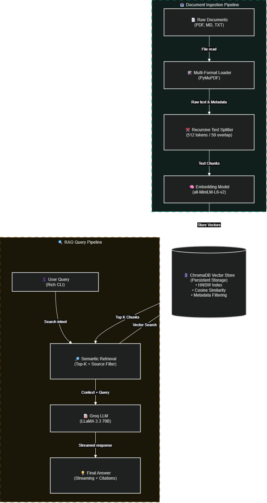

# 📚 Personal Knowledge Base — Project 3-I-A

A RAG-powered personal Q&A system that ingests your documents (PDFs, Markdown, Text), stores them as embeddings in ChromaDB, and answers questions with source citations using Groq LLM.

## 🏗️ Architecture

```
┌─────────────────────────────────────────────────────────────────┐
│                    INGESTION PIPELINE                            │
│                                                                  │
│  📄 Documents          🔪 Text Splitter      🧠 Embeddings      │
│  (PDF/MD/TXT)    ──▶  RecursiveCharacter  ──▶  all-MiniLM-L6   │
│  22+ files             512 tokens/chunk       384 dimensions    │
│                        50 token overlap                          │
│                                                                  │
│                              │                                   │
│                              ▼                                   │
│                    ┌──────────────────┐                          │
│                    │    ChromaDB      │                          │
│                    │  Vector Store    │                          │
│                    │  • HNSW Index    │                          │
│                    │  • Metadata      │                          │
│                    │  • Cosine Sim    │                          │
│                    └──────────────────┘                          │
│                              │                                   │
│                              ▼                                   │
│                    QUERY PIPELINE                                │
│                                                                  │
│  ❓ User Query    ──▶  🔍 Retrieval  ──▶  📝 LLM Generation    │
│  (CLI input)          top-k chunks        Groq LLaMA 3.3 70B   │
│                       + source filter      streaming response   │
│                                            + source citations   │
└─────────────────────────────────────────────────────────────────┘
```



## 🚀 Quick Start

### Prerequisites
```bash
pip install langchain langchain-groq chromadb sentence-transformers rich typer python-dotenv PyMuPDF groq
```

### Setup
1. Create a `.env` file in the project root with:
   ```
   GROQ_API_KEY=your_groq_api_key
   ```

2. Generate sample documents:
   ```bash
   python generate_docs.py
   ```

3. Ingest documents into the knowledge base:
   ```bash
   python main.py ingest ./sample_docs
   ```

4. Ask questions:
   ```bash
   python main.py ask "What is machine learning?"
   ```

## 📖 Usage

### Ingest Documents
```bash
# Ingest from default sample_docs directory
python main.py ingest

# Ingest from custom directory with custom chunk size
python main.py ingest /path/to/docs --chunk-size 1024 --overlap 100
```

### Ask Questions
```bash
# Simple question
python main.py ask "What is transfer learning?"

# Filter by source file
python main.py ask "What is NLP?" --source "03_natural_language_processing.md"

# Glob filter
python main.py ask "What are neural networks?" --source "02_*"

# More results
python main.py ask "Explain transformers" --top-k 10

# Disable streaming
python main.py ask "What is RAG?" --no-stream
```

### Explore Knowledge Base
```bash
# List all sources
python main.py list-sources

# Show statistics
python main.py stats

# Run full 15-question demo
python main.py demo
```

## 📂 Project Structure
```
personal_knowledge_base/
├── main.py              # CLI application (entry point)
├── generate_docs.py     # Sample document generator
├── sample_docs/         # 22 sample documents on AI/ML topics
│   ├── 01_machine_learning_basics.md
│   ├── 02_neural_networks.md
│   ├── ...
│   └── 22_data_engineering.md
├── qa_examples.json     # Generated Q&A demo results
├── .chromadb/           # ChromaDB persistent storage
└── README.md            # This file
```

## 📊 22 Sample Documents

| # | Document | Topic |
|---|----------|-------|
| 1 | Machine Learning Basics | Types of ML, ML pipeline |
| 2 | Neural Networks | Architecture, backpropagation, training |
| 3 | NLP | Text classification, NER, transformers |
| 4 | Computer Vision | CNNs, object detection, segmentation |
| 5 | Reinforcement Learning | Q-Learning, DQN, policy gradients |
| 6 | Transfer Learning | Feature extraction, fine-tuning |
| 7 | Generative AI | LLMs, diffusion, GANs, VAEs |
| 8 | Large Language Models | Architecture, training, inference |
| 9 | Embeddings & Vectors | Word2Vec, sentence embeddings, similarity |
| 10 | Attention Mechanism | QKV, multi-head, self-attention |
| 11 | Transformer Architecture | Encoder-decoder, scaling laws |
| 12 | Fine-tuning Strategies | LoRA, QLoRA, adapters, PEFT |
| 13 | Prompt Engineering | Zero/few-shot, CoT, ReAct |
| 14 | RAG Systems | Ingestion, retrieval, generation |
| 15 | Vector Databases | ChromaDB, FAISS, Qdrant, Pinecone |
| 16 | AI Ethics | Fairness, transparency, privacy |
| 17 | AI in Healthcare | Imaging, drug discovery, clinical AI |
| 18 | AI in Finance | Trading, fraud detection, risk |
| 19 | Federated Learning | Cross-device, cross-silo, FedAvg |
| 20 | MLOps | CI/CD, monitoring, model registry |
| 21 | AutoML | NAS, hyperparameter optimization |
| 22 | Data Engineering | Pipelines, data quality, storage |

## 🔬 15 Q&A Demo Examples

Run `python main.py demo` to execute all 15 questions:

1. What is machine learning and what are its main types?
2. Explain how neural networks learn through backpropagation.
3. What are the core tasks in Natural Language Processing?
4. How do convolutional neural networks work?
5. What is the difference between Q-Learning and Policy Gradient?
6. Explain transfer learning and its benefits.
7. What are the key technologies in Generative AI?
8. How are Large Language Models trained?
9. What are embeddings and why are they useful?
10. Explain the attention mechanism in transformers.
11. What is LoRA and efficient fine-tuning?
12. What are the main prompt engineering techniques?
13. How does RAG work and why is it important?
14. Compare ChromaDB, FAISS, and Qdrant.
15. What are the key practices in MLOps?

## ⚙️ Technology Stack

| Component | Technology |
|-----------|------------|
| Embeddings | `all-MiniLM-L6-v2` (sentence-transformers) |
| Vector Store | ChromaDB (persistent, HNSW index, cosine similarity) |
| LLM | Groq `llama-3.3-70b-versatile` |
| CLI Framework | Typer + Rich |
| Document Loading | PyMuPDF (PDF), built-in (TXT/MD) |
| Text Splitting | LangChain RecursiveCharacterTextSplitter |
