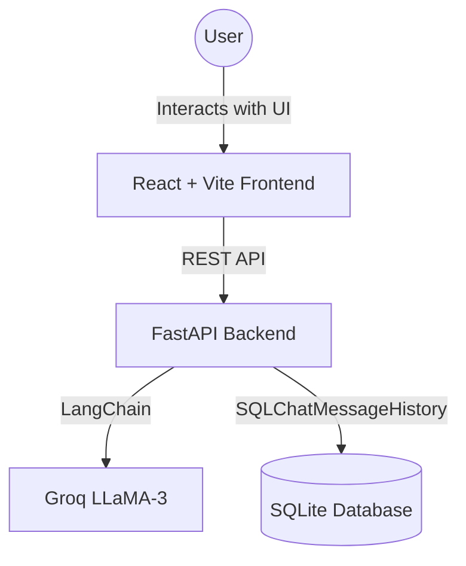

# AI-Powered Customer Support Platform

A production-ready customer support chatbot using FastAPI, LangChain, Groq, and a modern React frontend.

## Architecture Diagram


## Features
- **FastAPI Backend:** Fully async REST API with Pydantic request/response models.
- **Modern UI:** A stunning, premium glassmorphism dark-mode UI built with React and Vanilla CSS.
- **Session Management:** Conversation history is stored in a SQLite database and retrieved using LangChain's SQLChatMessageHistory.
- **Rate Limiting:** Custom middleware to limit requests per IP.
- **Containerized:** Fully deployable using Docker and Docker Compose.

## Setup Instructions
1. Navigate to the project root: `cd projects/support_platform`
2. Ensure you have your `GROQ_API_KEY` defined in the `.env` file at `Calder Internship/.env`.
3. Start the application using Docker Compose:
   ```bash
   docker-compose up --build
   ```
4. Access the frontend at `http://localhost:5173`
5. Access the backend API documentation (Swagger) at `http://localhost:8000/docs`

## API Endpoints
- `GET /health` : Health check.
- `POST /sessions` : Start a new chat session and get a `session_id`.
- `POST /messages` : Send a message to the AI agent.
- `GET /sessions/{session_id}/history` : Retrieve chat history.
